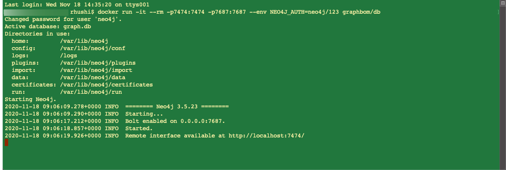

# Contribution 4 graphbom-neo4j

# Build the docker image
docker build . -t graphbom/db

# Run the docker image for neo4j
docker run -it --rm -p7474:7474 -p7687:7687 --env NEO4J_AUTH=neo4j/123 graphbom/db

# Contribution 5 Docker compose (compose the front end, backend and database as services using docker)
